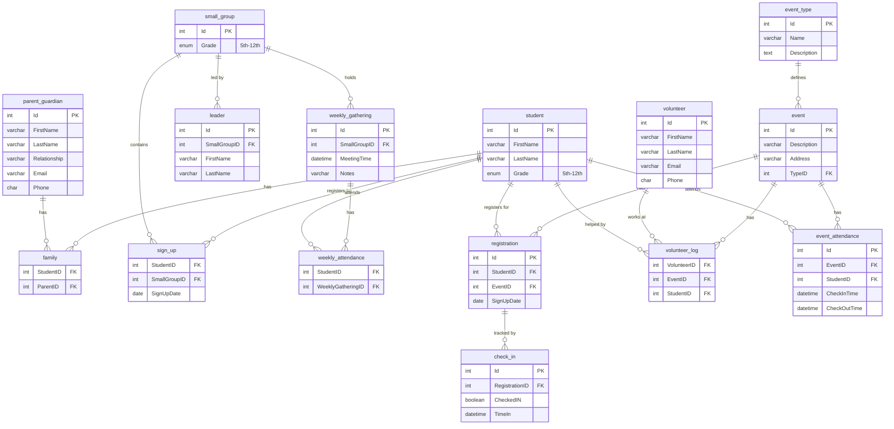

# Entity-Relationship Diagram

## Youth Group Management System - Database Schema

This document provides the complete Entity-Relationship (ER) diagram for the Youth Group Management System's MySQL database.

## ER Diagram (Mermaid Format)

## Entity Descriptions

### Core Entities

**student**
- Primary entity representing youth group participants
- Tracks basic information and grade level (5th-12th)
- Central to most relationships in the system

**parent_guardian**
- Represents parents/guardians of students
- Contains contact information for communication
- Linked to students through the family junction table

**family**
- Junction table connecting students to their parents/guardians
- Supports many-to-many relationship (students can have multiple guardians, guardians can have multiple students)

### Small Group Management

**small_group**
- Represents grade-based small groups for students
- Groups students by grade level for focused ministry

**leader**
- Leaders assigned to small groups
- One-to-many relationship with small_group

**weekly_gathering**
- Individual meeting sessions for small groups
- Tracks meeting times and notes

**weekly_attendance**
- Junction table tracking student attendance at weekly gatherings
- Links students to specific gathering sessions

**sign_up**
- Junction table for student small group enrollment
- Tracks which students are part of which small groups

### Event Management

**event_type**
- Defines types of events (e.g., "Summer Camp", "Youth Service", "Retreat")
- References MongoDB collection for custom field schemas

**event**
- Individual events (instances of event types)
- References MongoDB collection for custom event data
- Links to Redis for real-time check-in tracking

**registration**
- Tracks student registrations for events
- Junction between students and events

**check_in**
- Tracks check-in status for registered students
- Links to registration records

**event_attendance**
- Finalized attendance records (persisted from Redis)
- Permanent record of student attendance at events

### Volunteer Management

**volunteer**
- Represents volunteers who help at events
- Stores contact information

**volunteer_log**
- Junction table tracking volunteer assignments
- Links volunteers to events and optionally to specific students they're helping

## Key Relationships

1. **Student-Parent**: Many-to-many through `family` table
2. **Student-Small Group**: Many-to-many through `sign_up` table
3. **Small Group-Leader**: One-to-many (one group can have multiple leaders)
4. **Small Group-Weekly Gathering**: One-to-many (groups have multiple meetings)
5. **Event Type-Event**: One-to-many (one type defines many events)
6. **Student-Event**: Many-to-many through `registration` table
7. **Event-Volunteer**: Many-to-many through `volunteer_log` table

## Multi-Database Architecture Notes

This ER diagram represents the **MySQL relational database** structure. The complete system also includes:

- **MongoDB**: Stores dynamic event type schemas and custom event data (referenced by `event_type.Id` and `event.Id`)
- **Redis**: Handles real-time check-in/check-out tracking (data eventually persisted to `event_attendance` in MySQL)

## Database Normalization

The schema follows **Third Normal Form (3NF)**:
- All tables have primary keys
- No transitive dependencies
- Junction tables properly implement many-to-many relationships
- Foreign key constraints maintain referential integrity
